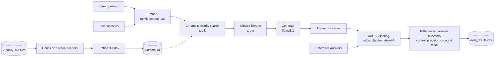

# Agentic RAG with RAGAS Evaluation

A local, retrieval-augmented Q&A system over internal company policy documents — built with Ollama, ChromaDB, Cohere Rerank, and Streamlit, with an offline RAGAS evaluation harness to actually measure whether it works.

Ask a question like *"What should I do if I suspect a policy violation?"* and it retrieves the relevant policy sections, reranks them for relevance, and generates a grounded answer with source attribution — while declining to answer questions the documents don't actually cover, rather than making something up.

## How it works



Offline and separate from the live query path: `scripts/evaluate.py` runs a fixed set of test questions through the full pipeline and scores the results with RAGAS (faithfulness, answer relevancy, context precision, context recall).

## Tech stack

| Component | Choice | Why |
|---|---|---|
| Generation | `llama3.2` via Ollama | Local, free, no API key |
| Embeddings | `nomic-embed-text` via Ollama | Local, 768-dim, free |
| Reranking | Cohere Rerank (`rerank-english-v3.0`) | Free tier, meaningfully improves retrieval precision over raw similarity |
| Vector store | ChromaDB | Simple, local, persistent |
| UI | Streamlit | Fast to build, good enough for a demo |
| Evaluation | RAGAS, judged by Claude (`claude-haiku-4-5`) | Reliable structured output, no rate-limit issues in testing |

## Setup

**Prerequisites:**
```bash
ollama pull llama3.2
ollama pull nomic-embed-text
```

**Install:**
```bash
python3 -m venv .venv
source .venv/bin/activate       # Windows: .venv\Scripts\activate
pip install -r requirements.txt
```

> Installing `chromadb` and friends can be memory-hungry. If you hit an `Exit code 137`, install packages one at a time instead of all at once.

**API keys:**
```bash
cp .env.example .env
```
Fill in:
- `COHERE_API_KEY` — [free tier](https://dashboard.cohere.com/api-keys), used for reranking
- `ANTHROPIC_API_KEY` — used only by `scripts/evaluate.py` as the judge model (requires API billing at [console.anthropic.com](https://console.anthropic.com), separate from a Claude Pro chat subscription)
- `GOOGLE_API_KEY` — listed for compatibility with the original spec but currently unused by `scripts/evaluate.py`; safe to leave blank

## Usage

**Build the index** (run once, and again whenever the policy docs change):
```bash
python3 scripts/ingest.py
```

**Run the app:**
```bash
streamlit run src/app.py
```
Opens at `http://localhost:8501`. Ask questions in plain English; answers come with source document/section attribution.

**Run the evaluation:**
```bash
python3 scripts/evaluate.py
```
Scores 8 test questions across all four RAGAS metrics and writes results to `data/eval_results.csv`.

## Evaluation results

Latest run, 8 questions spanning all 7 policy documents:

| Question | Faithfulness | Answer Relevancy | Context Precision | Context Recall |
|---|---|---|---|---|
| Email personal use | 0.67 | 0.81 | 1.00 | 1.00 |
| Policy violation reporting | 1.00 | 0.89 | 1.00 | 1.00 |
| Confidentiality on exit | 0.80 | 0.79 | 1.00 | 1.00 |
| Data breach notification | 0.67 | 0.79 | 1.00 | 1.00 |
| Flexible work arrangements | 0.86 | 0.79 | 0.83 | 1.00 |
| Compromised password | 0.50 | 0.88 | 1.00 | 1.00 |
| Whistleblowing anonymity | 0.50 | 0.88 | 1.00 | 1.00 |
| MFA requirement | 0.80 | 0.83 | 1.00 | 1.00 |
| **Mean** | **0.724** | **0.833** | **0.979** | **1.000** |

Context recall and precision are consistently strong — retrieval is doing its job. Faithfulness varies more between runs, largely because `llama3.2` isn't run at temperature 0 and occasionally over-specifies (e.g. citing a section number that doesn't exist in the source text) — a known tradeoff of using a small local model for generation.

## Notable engineering decisions

**Chunking strategy:** the policy documents mark sections with bold numbered headers (`**3. Acceptable Use**`) rather than real Markdown headers, so chunking splits on that convention to keep each section coherent — rather than fixed-size chunking, which risks cutting a policy rule in half.

**Declining gracefully:** the pipeline checks retrieval relevance before generating — if nothing retrieved clears a minimum relevance bar, it says so rather than fabricating an answer from weak context.

## Known limitations (v1 scope)

- Single-user, local-only demo — no auth, no cloud deployment
- Fictional company policy documents (grounded in real Singapore regulatory frameworks — PDPA, TG-FWAR — for realistic content, but the company itself is not real)
- Small local generation model (`llama3.2`) occasionally over-specifies details not strictly in the retrieved context
- No conversation memory — each question is answered independently

## Project structure

```
.
├── src/
│   ├── app.py          # Streamlit UI
│   ├── config.py        # Shared constants (models, paths, defaults)
│   ├── retriever.py      # Embed → Chroma search → Cohere rerank
│   └── rag_chain.py       # Retrieval + generation, with relevance gating
├── scripts/
│   ├── ingest.py         # Chunk & embed policy docs into ChromaDB
│   └── evaluate.py        # RAGAS evaluation harness
├── data/                 # ChromaDB store (gitignored) + eval results
├── *.md                  # The 7 policy documents themselves
└── CLAUDE.md             # Full build spec and documented deviations
```
